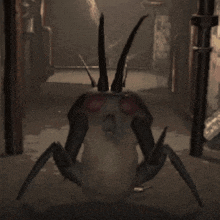

# The Ever Red

**The Ever Red** — a once sacred land lost to time.  
Explore a custom moon, featuring a familiar yet hauntingly altered experience. This moon stays true to the feel of vanilla Lethal Company while aiming to expand on its atmosphere and sense of exploration.

## 📦 Features

- A new vanilla-style moon to explore

 
- Subtle environmental and design twists  

- Built for seamless integration with other LethalLevelLoader moons  

## 🛠 Installation

Install via [r2modman](https://thunderstore.io/package/ebkr/r2modman/) or manually:

1. Download the `.zip` from Thunderstore.
2. Extract the contents into your Lethal Company `BepInEx/plugins/` folder.
3. Make sure `LethalLevelLoader` is installed as a dependency.

## 🔧 Dependencies

- [BepInExPack by BepInEx](https://thunderstore.io/c/lethal-company/p/BepInEx/BepInExPack/)
- [LethalLevelLoader by IAmBatby](https://thunderstore.io/c/lethal-company/p/IAmBatby/LethalLevelLoader//)

## 🙏 Thanks & Credits
- **Mouseclops** 
- **Audio Knight**
- **Bepin**
- **IAmBatby**
- **r2modman**

---

Thanks for downloading! 
